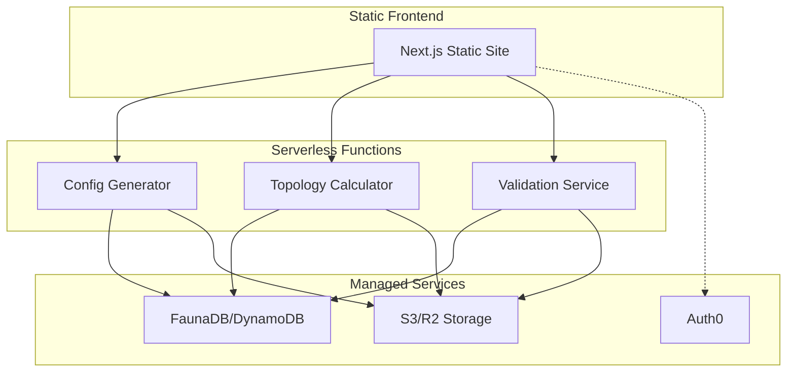

# Serverless Architecture Guide

## Architecture Overview

### Core Components
1. **Static Frontend**
   - Next.js static site
   - Hosted on Vercel/Netlify
   - Zero server management

2. **Serverless API Functions**
   - Individual API endpoints as functions
   - Zero server management
   - Auto-scaling built-in

3. **Managed Services**
   - All infrastructure handled by service providers
   - Pay-per-use pricing
   - Zero maintenance overhead



## Service Selection

### Frontend Hosting
- **Vercel** (Recommended)
  - Native Next.js support
  - Global CDN
  - Automatic deployments

- **Alternative: Netlify**
  - Similar capabilities
  - Good CI/CD integration

### Serverless Functions
- **Vercel Functions** (Recommended)
  - Tight integration with frontend
  - Python support
  - Automatic API routes

- **Alternatives:**
  - AWS Lambda
  - Cloudflare Workers
  - Netlify Functions

### Database
- **FaunaDB** (Recommended)
  - True serverless database
  - GraphQL native
  - ACID transactions
  ```javascript
  // Example FaunaDB schema
  CreateCollection({
    name: 'configurations',
    history_days: 30
  })
  ```

- **Alternative: DynamoDB**
  - AWS native
  - Highly scalable
  ```javascript
  // DynamoDB schema
  {
    TableName: 'Configurations',
    KeySchema: [
      { AttributeName: 'id', KeyType: 'HASH' }
    ],
    AttributeDefinitions: [
      { AttributeName: 'id', AttributeType: 'S' }
    ]
  }
  ```

### File Storage
- **Cloudflare R2** (Recommended)
  - S3 compatible
  - Lower costs
  - Global distribution

- **Alternative: AWS S3**
  - Industry standard
  - Extensive ecosystem

### Authentication
- **Auth0** (Recommended)
  - Fully managed
  - Multiple providers
  - Simple integration

- **Alternative: Clerk**
  - User management
  - Modern API

## Implementation Guidelines

### 1. Frontend Implementation
```typescript
// pages/api redirects to serverless functions
// pages/index.tsx - Static Generation
export const getStaticProps = async () => {
  return {
    props: {
      initialData: {}
    },
    revalidate: 3600 // Optional ISR
  }
}
```

### 2. API Functions
```typescript
// Each API endpoint is a separate function
// api/calculate-topology.ts
import type { VercelRequest, VercelResponse } from '@vercel/node'

export default async function handler(
  req: VercelRequest,
  res: VercelResponse
) {
  const { serverPorts, oversubscription } = req.body
  
  // Process in function
  const result = await calculateTopology(serverPorts, oversubscription)
  
  return res.json(result)
}
```

### 3. Data Storage
```typescript
// Using FaunaDB
import { Client, query as q } from 'faunadb'

export async function saveConfiguration(config: Config) {
  const client = new Client({
    secret: process.env.FAUNA_SECRET
  })
  
  return await client.query(
    q.Create(
      q.Collection('configurations'),
      { data: config }
    )
  )
}
```

### 4. File Storage
```typescript
// Using R2
import { S3Client } from '@aws-sdk/client-s3'

const R2 = new S3Client({
  endpoint: process.env.R2_ENDPOINT,
  credentials: {
    accessKeyId: process.env.R2_ACCESS_KEY_ID,
    secretAccessKey: process.env.R2_SECRET_ACCESS_KEY
  }
})
```

## Deployment Configuration

### Vercel Configuration
```json
{
  "build": {
    "env": {
      "NEXT_PUBLIC_API_URL": "@api_url"
    }
  },
  "functions": {
    "api/*.ts": {
      "memory": 1024,
      "maxDuration": 10
    }
  }
}
```

### Environment Variables
```bash
# .env.production
FAUNA_SECRET=xxx
R2_ACCESS_KEY_ID=xxx
R2_SECRET_ACCESS_KEY=xxx
AUTH0_DOMAIN=xxx
AUTH0_CLIENT_ID=xxx
```

## Cost Optimization

### Function Optimization
- Keep functions small and focused
- Use appropriate memory allocation
- Implement caching where beneficial

### Storage Optimization
- Use appropriate storage tiers
- Implement lifecycle policies
- Cache static assets

### Database Optimization
- Use appropriate indexes
- Batch operations where possible
- Implement connection pooling

## Scaling Considerations

### Frontend Scaling
- Automatic with CDN
- No action required
- ISR for dynamic content

### Function Scaling
- Automatic scaling
- Cold start mitigation:
  - Keep functions warm
  - Use provisioned concurrency

### Database Scaling
- FaunaDB scales automatically
- Monitor usage patterns
- Implement caching

## Monitoring and Logging

### Vercel Analytics
- Built-in performance monitoring
- Real-time logs
- Error tracking

### Custom Monitoring
```typescript
// api/log.ts
export default async function log(
  req: VercelRequest,
  res: VercelResponse
) {
  // Log to your preferred service
  await logEvent({
    type: req.body.type,
    data: req.body.data
  })
  
  res.status(200).end()
}
```

## Development Workflow

### Local Development
```bash
# Install Vercel CLI
npm i -g vercel

# Run locally
vercel dev

# Deploy
vercel --prod
```

### Testing
```bash
# Use test environment
vercel env pull .env.test
npm test
```

## Security Considerations

### Function Security
- Implement rate limiting
- Validate inputs
- Use environment secrets

### Data Security
- Enable encryption at rest
- Implement backup strategy
- Use least privilege access

## Backup Strategy

### Database Backup
- FaunaDB automatic backups
- Additional snapshot exports

### File Backup
- R2/S3 versioning
- Cross-region replication