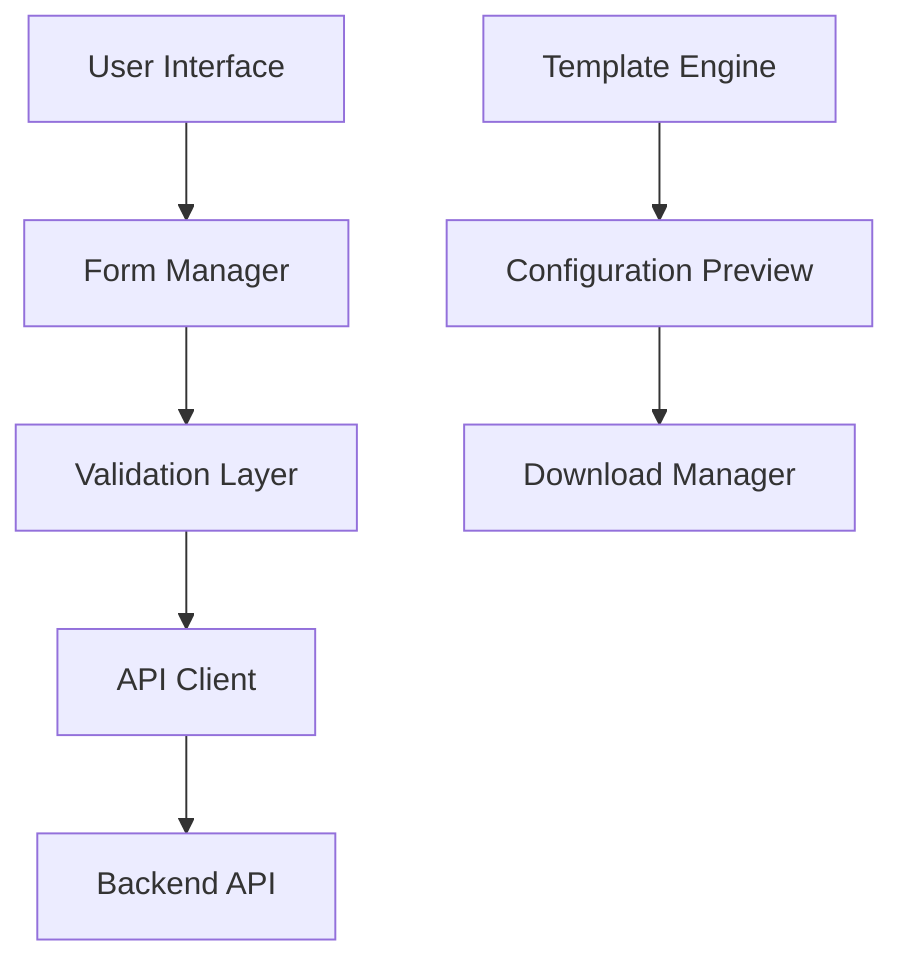
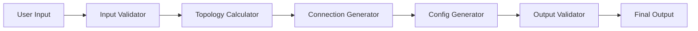

# Technical Design Document

## System Architecture

### Frontend Architecture


### Data Flow


## Core Components

### 1. Input Handler
- Manages form state and validation
- Implements multi-step input process
- Provides immediate feedback
- TypeScript interfaces:
```typescript
interface TopologyInput {
  serverPorts: number;
  oversubscriptionRatio: number;
  switchModel: string;
  redundancyType: 'mclag' | 'eslag';
}

interface NetworkInput {
  managementSubnet: string;
  externalSubnet: string;
  credentials: CredentialInput;
}
```

### 2. Topology Calculator
- Python class for topology calculations
- Handles switch quantity calculations
- Manages port assignments
```python
class TopologyCalculator:
    def __init__(self, switch_profile: SwitchProfile):
        self.profile = switch_profile

    def calculate_requirements(
        self,
        server_ports: int,
        oversubscription: float
    ) -> TopologyRequirements:
        # Calculate switch quantities
        # Determine port assignments
        # Return complete topology plan
```

### 3. Configuration Generator
- Generates kubernetes manifests
- Creates wiring diagrams
- Produces inventory lists
```python
class ConfigGenerator:
    def generate_manifests(
        self,
        topology: TopologyPlan,
        network_config: NetworkConfig
    ) -> List[KubernetesManifest]:
        # Generate all required kubernetes objects
        # Validate configurations
        # Return complete manifest set
```

## API Endpoints

### 1. Topology Calculation
```plaintext
POST /api/calculate-topology
Request:
{
    "serverPorts": number,
    "oversubscription": number,
    "switchModel": string
}
Response:
{
    "leafSwitches": number,
    "spineSwitches": number,
    "portAssignments": PortAssignment[]
}
```

### 2. Configuration Generation
```plaintext
POST /api/generate-config
Request:
{
    "topology": TopologyPlan,
    "network": NetworkConfig,
    "credentials": CredentialConfig
}
Response:
{
    "manifests": KubernetesManifest[],
    "wiringDiagram": WiringDiagram,
    "inventory": InventoryList
}
```

## Data Models

[Include detailed data models for all major components]

## Validation Rules

[Include validation rules and error handling specifications]