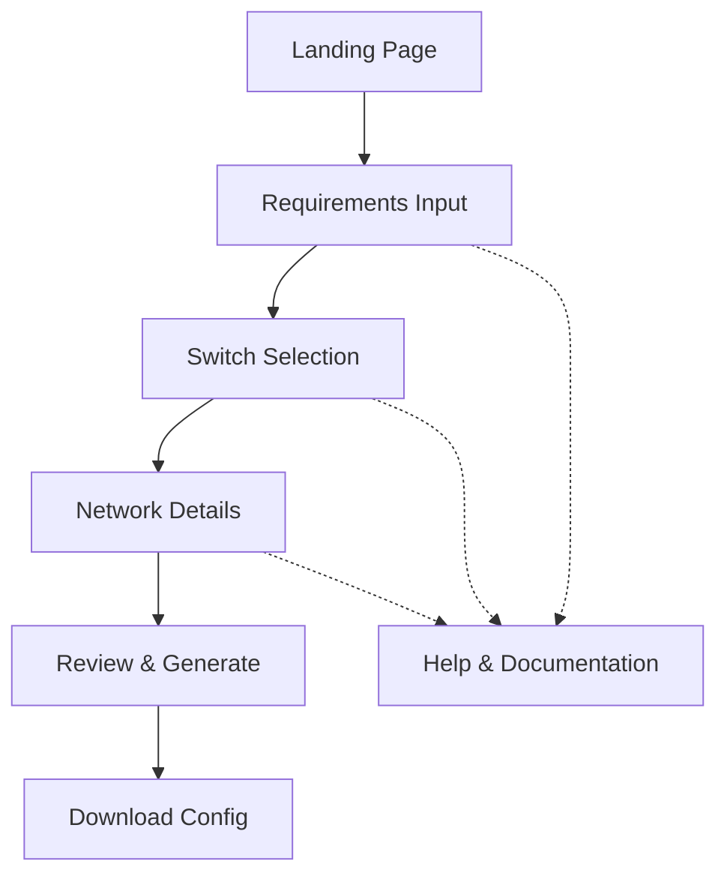
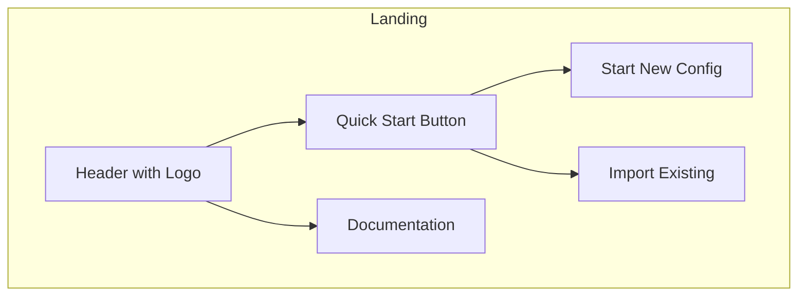
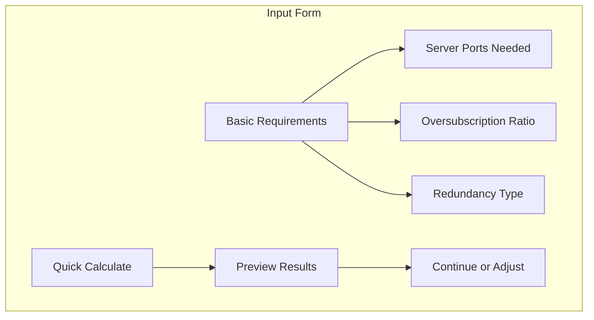
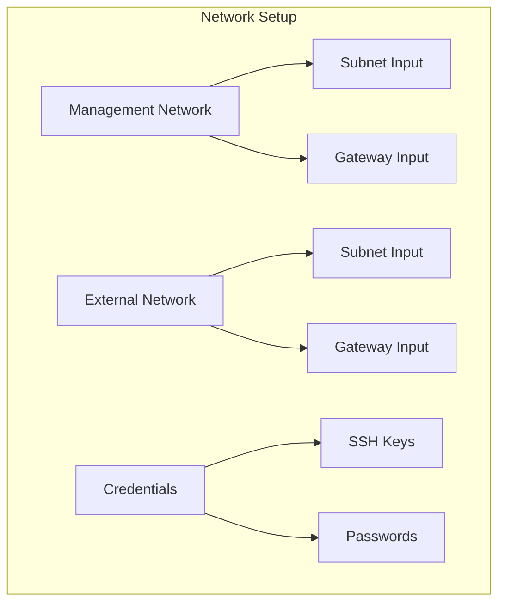
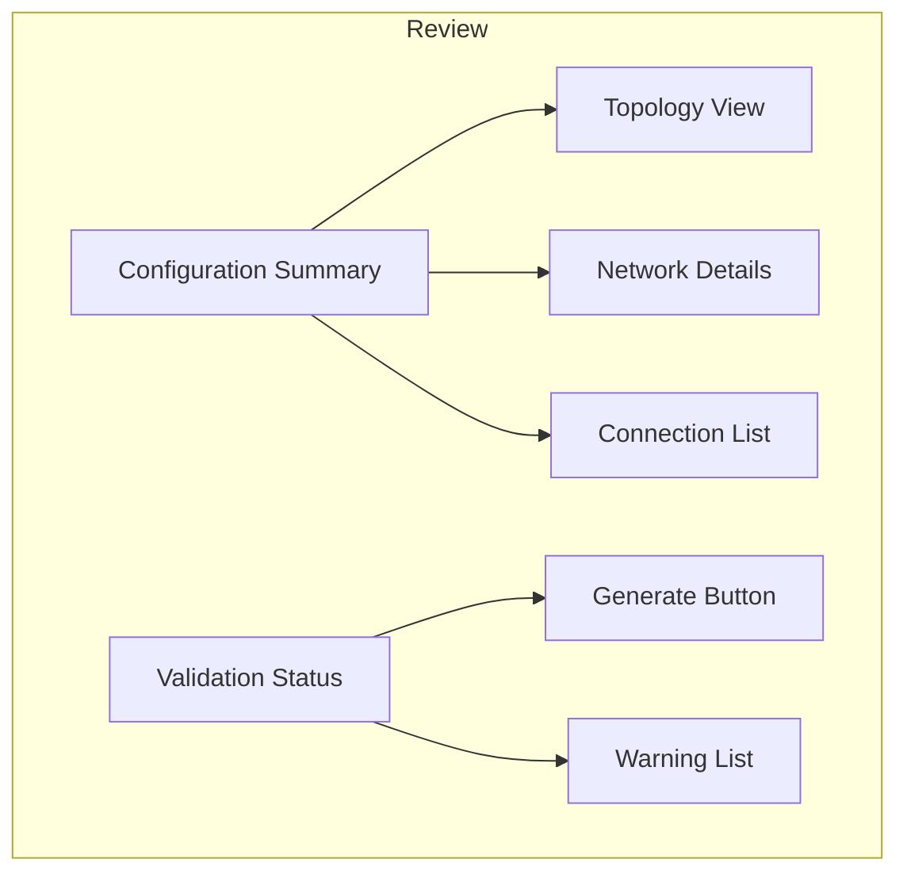

# UI Wireframes and Workflow

## User Interface Flow



## Key Screens

### 1. Landing Page


### 2. Requirements Input Form


### 3. Network Details Form


### 4. Review & Generate


## Component Design

### Interactive Topology Viewer
```
+------------------------+
|  [Topology Diagram]    |
|                        |
|  O--O     O--O        |
|  |  |     |  |        |
|  O--O     O--O        |
|                        |
+------------------------+
|  [Details Panel]       |
+------------------------+
```

### Configuration Form
```
+------------------------+
| Basic Requirements     |
|                        |
| Server Ports: [____]   |
| Ratio:        [____]   |
| Switch Model: [▼____]  |
|                        |
| [Calculate] [Preview]  |
+------------------------+
```

### Review Panel
```
+------------------------+
| Configuration Review   |
|                        |
| ✓ Topology Valid      |
| ⚠ High Bandwidth      |
| ✓ Connections Valid   |
|                        |
| [Download] [Edit]      |
+------------------------+
```

## Interactive Features

1. **Real-time Validation**
   - Input validation with immediate feedback
   - Topology preview updates
   - Bandwidth calculations

2. **Dynamic Form Fields**
   - Conditional inputs based on selections
   - Auto-complete suggestions
   - Template selection

3. **Visual Feedback**
   - Success/error states
   - Progress indicators
   - Warning highlights

4. **Help Features**
   - Context-sensitive help
   - Documentation links
   - Example configurations

## Mobile Considerations

1. **Responsive Layout**
   - Stack forms vertically
   - Collapsible sections
   - Touch-friendly inputs

2. **Simplified Views**
   - Essential information first
   - Progressive disclosure
   - Clear CTAs

## Accessibility

1. **Keyboard Navigation**
   - Logical tab order
   - Keyboard shortcuts
   - Focus management

2. **Screen Readers**
   - ARIA labels
   - Meaningful descriptions
   - Status announcements

## Theme Support

1. **Color Schemes**
   - Light/dark mode
   - High contrast option
   - Brand-aligned colors

2. **Typography**
   - Clear hierarchy
   - Readable fonts
   - Consistent spacing