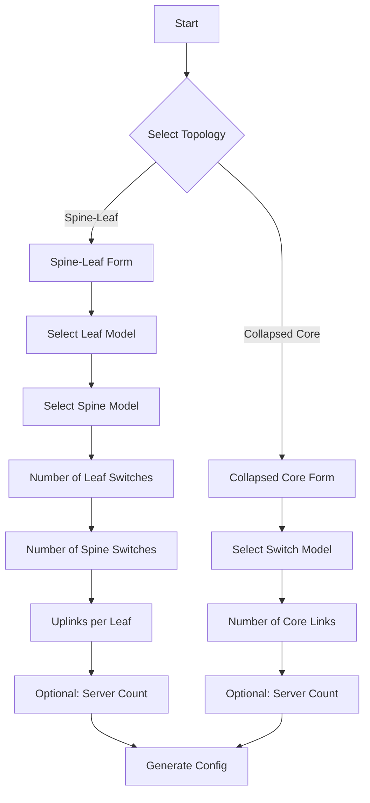

# Updated UI Flow and Input Requirements

## Form Flow



## Input Forms

### Spine-Leaf Configuration
```typescript
interface SpineLeafInput {
  // Required fields
  leafModel: string;          // From supported models list
  spineModel: string;        // From supported models list
  leafCount: number;         // Number of leaf switches
  spineCount: number;        // Number of spine switches
  uplinksPerLeaf: number;   // Number of uplinks per leaf
  
  // Optional fields
  serverCount?: number;      // Total number of servers to configure
}
```

### Collapsed Core Configuration
```typescript
interface CollapsedCoreInput {
  // Required fields
  switchModel: string;      // From supported models list
  coreLinks: number;       // Number of links between cores
  
  // Optional fields
  serverCount?: number;    // Total number of servers to configure
}
```

## Validation Rules

### Spine-Leaf Validation
```typescript
function validateSpineLeaf(input: SpineLeafInput, switchProfiles: SwitchProfiles): ValidationResult {
  const leafProfile = switchProfiles[input.leafModel];
  const spineProfile = switchProfiles[input.spineModel];
  
  // Validate leaf ports
  const portsPerLeaf = leafProfile.getStandardPorts().length;
  const requiredLeafPorts = (input.serverCount || 0) / input.leafCount + input.uplinksPerLeaf;
  
  // Validate spine ports
  const portsPerSpine = spineProfile.getStandardPorts().length;
  const requiredSpinePorts = input.leafCount * input.uplinksPerLeaf / input.spineCount;
  
  return {
    valid: requiredLeafPorts <= portsPerLeaf && requiredSpinePorts <= portsPerSpine,
    errors: []  // Add specific errors if invalid
  };
}
```

### Collapsed Core Validation
```typescript
function validateCollapsedCore(input: CollapsedCoreInput, switchProfiles: SwitchProfiles): ValidationResult {
  const switchProfile = switchProfiles[input.switchModel];
  const standardPorts = switchProfile.getStandardPorts().length;
  
  // Validate enough ports for core links and servers
  const requiredPorts = input.coreLinks + (input.serverCount ? input.serverCount / 2 : 0);
  
  return {
    valid: requiredPorts <= standardPorts,
    errors: []  // Add specific errors if invalid
  };
}
```

## Server Port Auto-Configuration

### Distribution Logic
```typescript
interface ServerPortConfig {
  serverId: string;
  switchId: string;
  portId: string;
  connection: {
    type: 'unbundled';
    serverPort: string;
    switchPort: string;
  };
}

function generateServerConfigs(
  topology: 'spine-leaf' | 'collapsed-core',
  serverCount: number,
  switches: Switch[]
): ServerPortConfig[] {
  const configs: ServerPortConfig[] = [];
  const switchCount = switches.length;
  
  // Distribute servers evenly
  for (let i = 0; i < serverCount; i++) {
    const targetSwitch = switches[i % switchCount];
    configs.push({
      serverId: `server-${i + 1}`,
      switchId: targetSwitch.id,
      portId: `port-${i}`,
      connection: {
        type: 'unbundled',
        serverPort: `eth0`,
        switchPort: targetSwitch.getNextAvailablePort()
      }
    });
  }
  
  return configs;
}
```

## Example Generated Output

### Spine-Leaf Example
```yaml
# For user input:
# - 4 leaf switches
# - 2 spine switches
# - 4 uplinks per leaf
# - 48 servers

switches:
  leaf-1:
    model: dell-s5248f-on
    uplinks:
      - to: spine-1
        ports: [49, 50]
      - to: spine-2
        ports: [51, 52]
    servers: [server-1..12]  # Auto-distributed

  leaf-2:
    # Similar configuration...

connections:
  server-1:
    type: unbundled
    switch: leaf-1
    port: E1/1
    server_port: eth0
  # More server connections...
```

### Collapsed Core Example
```yaml
# For user input:
# - 2 core links
# - 24 servers

switches:
  core-1:
    model: dell-s5248f-on
    peer_links:
      - to: core-2
        ports: [49, 50]
    servers: [server-1..12]

  core-2:
    # Similar configuration...
```